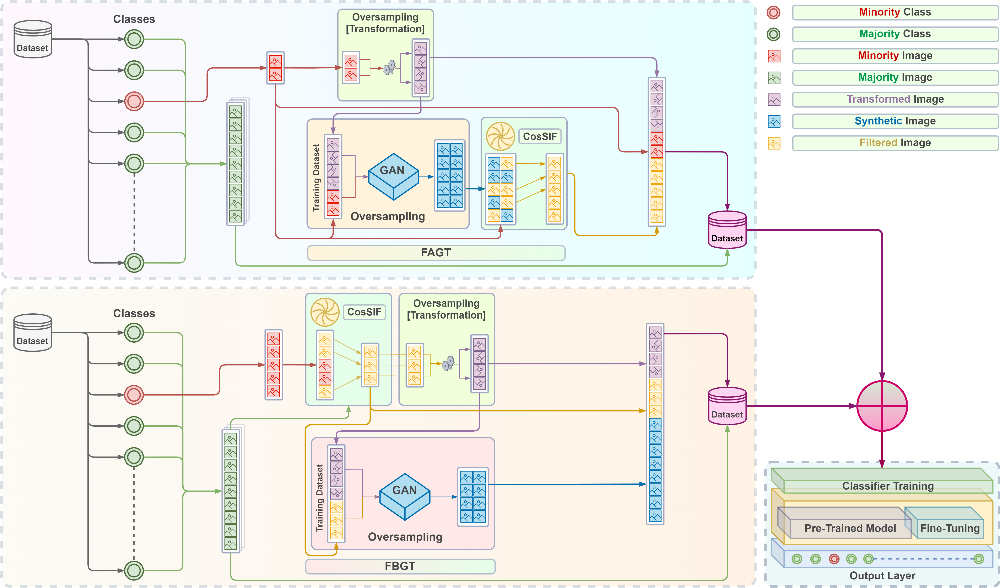
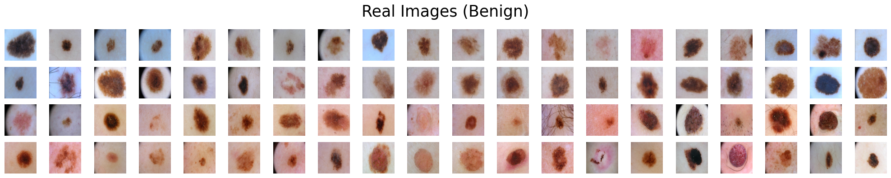
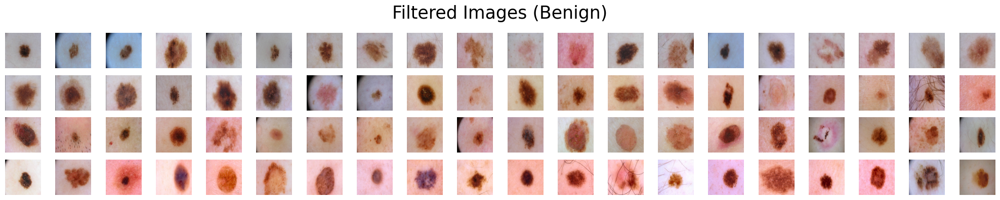
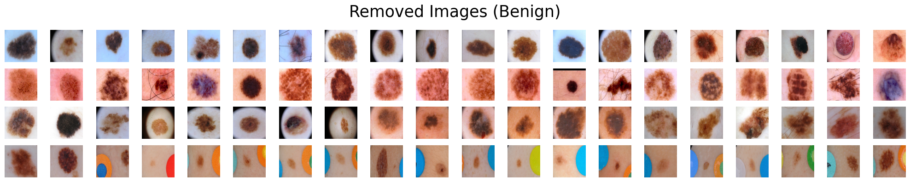
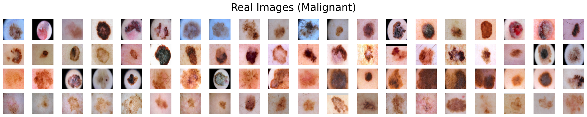
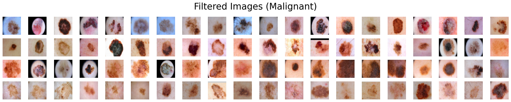
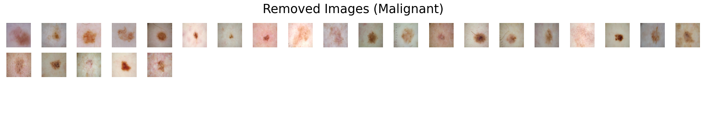

## CosSIF: Cosine Similarity-based Image Filtering

<p align="left">

</p>

<b>CosSIF: Cosine similarity-based image filtering to overcome low inter-class variation in synthetic medical image datasets</b>

<p>Mominul Islam, Hasib Zunair, Nabeel Mohammed</p>
 
[https://doi.org/10.1016/j.compbiomed.2024.108317](https://doi.org/10.1016/j.compbiomed.2024.108317)<br>

<p>Abstract: <i>Crafting effective deep learning models for medical image analysis is a complex task, particularly in cases where the medical image dataset lacks significant inter-class variation. This challenge is further aggravated when employing such datasets to generate synthetic images using generative adversarial networks (GANs), as the output of GANs heavily relies on the input data. In this research, we propose a novel filtering algorithm called Cosine Similarity-based Image Filtering (CosSIF). We leverage CosSIF to develop two distinct filtering methods: Filtering Before GAN Training (FBGT) and Filtering After GAN Training (FAGT). FBGT involves the removal of real images that exhibit similarities to images of other classes before utilizing them as the training dataset for a GAN. On the other hand, FAGT focuses on eliminating synthetic images with less discriminative features compared to real images used for training the GAN. The experimental results reveal that the utilization of either the FAGT or FBGT method reduces low inter-class variation in clinical image classification datasets and enables GANs to generate synthetic images with greater discriminative features. Moreover, modern transformer and convolutional-based models, trained with datasets that utilize these filtering methods, lead to less bias toward the majority class, more accurate predictions of samples in the minority class, and overall better generalization capabilities.</i></p>

## 1. Specification of dependencies
This code requires two separate conda environments. Run the following to install the required packages on Windows.

```python
cd environments/
conda env create -f csf-ovs.yml
conda env create -f csf-model.yml
```

The following notebooks require the `csf-ovs` environment to be activated.

```
scripts/
|-- HAM10000/
|---- HAM10000_filtering/
|------ HAM10000_FAGT.ipynb
|------ HAM10000_FBGT.ipynb
|---- HAM10000_GAN_train.ipynb
|---- HAM10000_augment_ds.ipynb
|---- HAM10000_oversampling.ipynb
|---- HAM10000_pre-processing.ipynb
|-- ISIC-2016/
|---- ISIC-2016_filtering/
|------ ISIC-2016_FAGT.ipynb
|------ ISIC-2016_FBGT.ipynb
|---- ISIC-2016_GAN_train.ipynb
|---- ISIC-2016_augment_ds.ipynb
|---- ISIC-2016_oversampling.ipynb
|---- ISIC-2016_pre-processing.ipynb
```

Run the following to activate the `csf-ovs` environment.

```python
conda activate csf-ovs
```

The rest of the notebooks require the `csf-model` environment to be activated. Run the following to activate the `csf-model` environment.

```python
conda activate csf-model
```

The conda environments can also be setup manually. Install the packages mentioned `packages.txt` file.

Install [Visual Studio 2019](https://visualstudio.microsoft.com/vs/older-downloads/) along with the following workloads:
- Desktop development with C++
- Universal Windows Platform development

## 2a. Datasets
Download and extract the [HAM10000](https://dataverse.harvard.edu/dataset.xhtml?persistentId=doi:10.7910/DVN/DBW86T) and [ISIC-2016](https://challenge.isic-archive.com/data/) (Task-3) datasets, along with their associated ground truth files. Then, create a folder named datasets in the root directory and organize the folders and ground truth files in the following order:

```
datasets/
|-- HAM10000/
|---- downloads/
|------ HAM10000_images/
|------ HAM10000_metadata.csv
|-- ISIC-2016/
|---- downloads/
|------ ISBI2016_ISIC_Part3_Training_Data/
|------ ISBI2016_ISIC_Part3_Test_Data/
|-------ISBI2016_ISIC_Part3_Training_GroundTruth.csv
|-------ISBI2016_ISIC_Part3_Test_GroundTruth.csv
```

Note that you may need to rename the file and folder names as required.

## 2b. Pre-processing
To begin the pre-processing, run the following scripts associated with each dataset:

```
ISIC-2016_pre-processing.ipynb
```
```
HAM10000_pre-processing.ipynb
```

## 2c. Oversampling & filtering
For oversampling, run the following scripts associated with each dataset:

```
ISIC-2016_oversampling.ipynb
```
```
HAM10000_oversampling.ipynb
```

During the execution of the oversampling scripts, there comes a certain point where it becomes necessary to also execute the filtering and GAN training scripts.

For filtering, run the following scripts associated with each dataset:

```
ISIC-2016_FBGT.ipynb
ISIC-2016_FAGT.ipynb
```
```
HAM10000_FBGT.ipynb
HAM10000_FAGT.ipynb
```

For GAN training, run the following scripts associated with each dataset on [Kaggle](https://www.kaggle.com/):

```
ISIC-2016_GAN_train.ipynb
```
```
HAM10000_GAN_train.ipynb
```

Note that the saving of the trained GANs on [Kaggle](https://www.kaggle.com/) must be conducted manually. The details are provided on the scripts and must be followed accordingly.

## 2d. Dataset Augmentation
To achieve the final augmented datasets associated with each different experiment, run the following codes.

```
ISIC-2016_augment_ds.ipynb
```
```
HAM10000_augment_ds.ipynb
```

## 2e. Training Models
To train the models on the oversampled ISIC-2016 dataset and its filtered variants, navigate to the following directory and run the scripts. 

```
scripts/
|-- ISIC-2016/
|---- ISIC-2016_model_train/
|------ ConvNeXt/
|------ Swin-Transformer/
|------ ViT/
```

To train the models on the oversampled HAM10000 dataset and its filtered variants, navigate to the following directory and upload the scripts on [Kaggle](https://www.kaggle.com/) along with its corresponding variants of the dataset. 

```
scripts/
|-- HAM10000/
|---- HAM10000_model_train/
|------ ConvNeXt/
|------ Swin-Transformer/
|------ ViT/
```

Note that the saving of the trained models on [Kaggle](https://www.kaggle.com/) must be conducted manually. The details are provided on the scripts and must be followed accordingly.

## 2f. Performance evaluation
The performance evaluation of all our pre-trained models can be done anytime, provided that the models reside in the following folder order.

```
models/
|-- HAM10000/
|---- ConvNeXt/
|------ ham10000-convnext-fagt-alpha-3
|------ ham10000-convnext-fbgt-alpha-1
|------ ham10000-convnext-no-filtering
|---- Swin-Transformer/
|------ ham10000-swin-fagt-alpha-1
|------ ham10000-swin-fagt-alpha-2
|------ ham10000-swin-fagt-alpha-3
|------ ham10000-swin-fbgt-alpha-1
|------ ham10000-swin-fbgt-alpha-2
|------ ham10000-swin-fbgt-alpha-3
|------ ham10000-swin-no-filtering
|---- ViT/
|------ ham10000-vit-fagt-alpha-3
|------ ham10000-vit-fbgt-alpha-1
|------ ham10000-vit-no-filtering
|-- ISIC-2016/
|---- ConvNeXt/
|------ ISIC-2016-convnext-fagt-alpha-3
|------ ISIC-2016-convnext-fbgt-alpha-1
|------ ISIC-2016-convnext-no-filtering
|---- Swin-Transformer/
|------ ISIC-2016-swin-fagt-alpha-1
|------ ISIC-2016-swin-fagt-alpha-2
|------ ISIC-2016-swin-fagt-alpha-3
|------ ISIC-2016-swin-fbgt-alpha-1
|------ ISIC-2016-swin-fbgt-alpha-2
|------ ISIC-2016-swin-fbgt-alpha-3
|------ ISIC-2016-swin-no-filtering
|---- ViT/
|------ ISIC-2016-vit-fagt-alpha-3
|------ ISIC-2016-vit-fbgt-alpha-1
|------ ISIC-2016-vit-no-filtering
```

To evaluate the performance of all trained models on the oversampled ISIC-2016 dataset and its variants, run the following script:

```
ISIC-2016_model_test.ipynb
```

To evaluate the performance of all trained models on the oversampled HAM10000 dataset and its variants, run the following script:

```
HAM10000_model_test.ipynb
```

## 3. Pre-trained models
We provide our pre-trained models on [GitHub Releases](https://github.com/mominul-ssv/cossif/releases/tag/v1.0.0) for reproducibility. Below are the best-performing pre-trained models.

| Dataset | Model | Filtering | Sensitivity (%) | False Negative | Download |
| -------- | -------- | -------- | :--------: | :--------: | -------- |
| ISIC-2016 | ViT | FAGT (α = 0.75) | **72.00** | **21** |[download](https://github.com/mominul-ssv/cossif/releases/download/v1.0.0/isic-2016-vit-fagt-alpha-1.zip) |

| Dataset | Model | Filtering | Accuracy (%) | F1-score (%) | Download |
| -------- | -------- | -------- | :--------: | :--------: | -------- |
| HAM10000 | ConvNeXt | FAGT (α = 0.85) | **94.44** | **84.06** | [download](https://github.com/mominul-ssv/cossif/releases/download/v1.0.0/ham10000-convnext-fagt-alpha-3.zip) |

## 4. Demo
We offer CosSIF as an end-to-end module, available on [PyPI](https://pypi.org/project/cossif/). To implement this filtering method, kindly adhere to the subsequent instructions:

Suppose we are presented with two categories of skin lesions: benign and malignant. Our objective is to sift out benign images that bear resemblance to malignant ones, and similarly, malignant images that bear resemblance to benign ones.

```python
from cossif import cossif
```

```python
csf = cossif.CosSIF()
```

```python
# Filter benign images
csf.calculate_and_filter(
    target_path=cls_benign,              # Path to the folder that contains benign images.
    secondary_path=cls_malignant,        # Path to the folder that contains malignant images.
    filtered_path=cls_benign_filtered,   # Path to the folder that will contain filtered benign images.
    removed_path=cls_benign_removed,     # Path to the folder that will contain removed benign images.
    record_save_path=save_path,          # Save path of the similarity calculation record.
    record_keep=False,                   # Chose whether to keep the similarity calculation record or not.
    file_name='t_benign_x_s_malignant',  # Name of the similarity calculation record file.
    filter_type='dissimilar',            # Type of filtering. Can be either "similar" or "dissimilar".
    filter_range=0.85,                   # The filtering ratio. A value of 0.85 means that 15% of the images will be removed.
)
```

<p align="left">

</p>
<p align="left">

</p>
<p align="left">

</p>

```python
# Filter malignant images
csf.calculate_and_filter(
    target_path = cls_malignant,
    secondary_path = cls_benign,
    filtered_path=cls_malignant_filtered,
    removed_path=cls_malignant_removed,
    record_save_path = save_path,
    record_keep=False,
    file_name = 't_malignant_x_s_benign',
    filter_type = 'similar',
    filter_range = 0.85,
)
```

<p align="left">

</p>
<p align="left">

</p>
<p align="left">

</p>


## 5. Citation
```
@article{islam2024cossif,
  title={CosSIF: Cosine similarity-based image filtering to overcome low inter-class variation in synthetic medical image datasets},
  author={Islam, Mominul and Zunair, Hasib and Mohammed, Nabeel},
  journal={Computers in Biology and Medicine},
  volume={172},
  pages={108317},
  year={2024},
  publisher={Elsevier}
}
```

### Acknowledgements
This code base is built on top of the following repositories:
- https://github.com/NVlabs/stylegan2-ada-pytorch

This code utilizes the following models for fine-tuning:
- https://huggingface.co/microsoft/swin-tiny-patch4-window7-224
- https://huggingface.co/google/vit-base-patch16-224
- https://huggingface.co/facebook/convnext-tiny-224

## 5. License
- Copyright @ Mominul Islam.
- ORCID iD: https://orcid.org/0009-0001-6409-964X